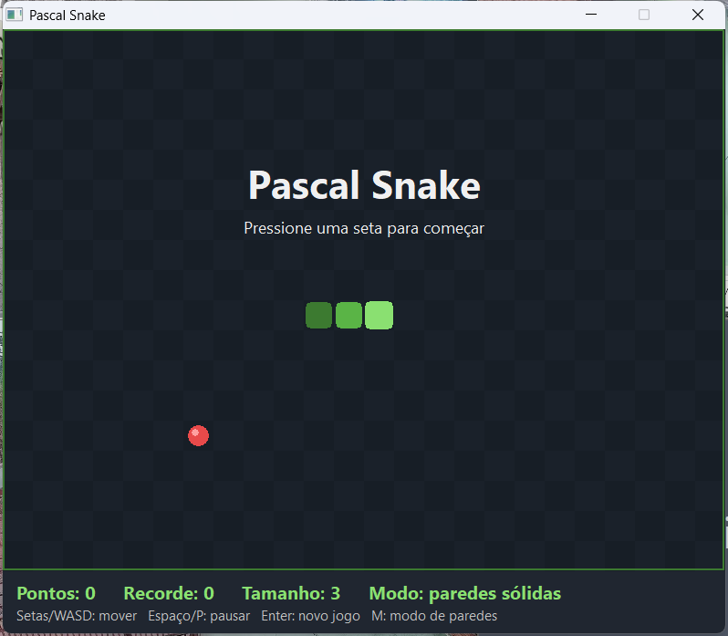
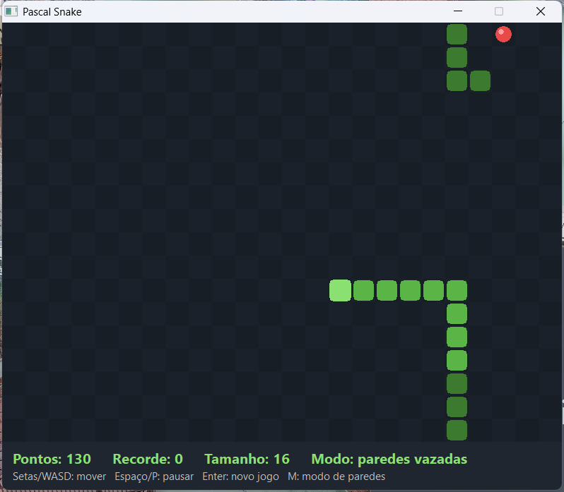
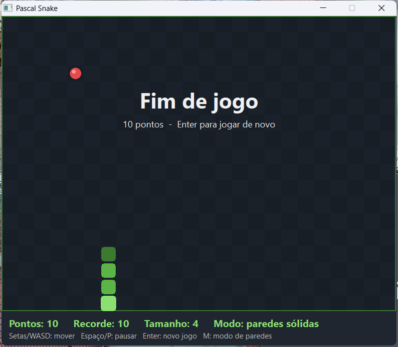
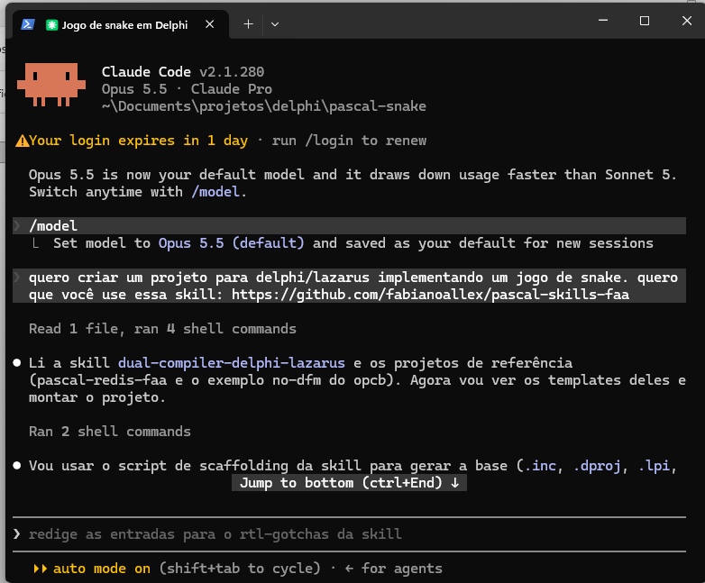

# Pascal Snake

A Snake game in Object Pascal where **one codebase compiles with both Delphi (VCL) and Lazarus/FPC (LCL)**.

This repository is a **worked example** for the [`dual-compiler-delphi-lazarus`](https://github.com/fabianoallex/pascal-skills-faa) Claude Code skill. The whole project (game, tests, project files and docs) was produced by Claude Code (Opus 5.5) from one short prompt. The agent was pointed at the skill and followed it. Everything here, including the dead ends, shows what the skill did and didn't cover.

| Start screen | Wrap-around walls, 130 points | Game over |
|---|---|---|
|  |  |  |

*The UI text is in Portuguese; the author's audience is Brazilian.*

## The prompt

This was the whole request (in Portuguese: *"I want to create a Delphi/Lazarus project implementing a snake game. I want you to use this skill: https://github.com/fabianoallex/pascal-skills-faa"*):



The skill never tells the agent to build a game. It supplies the **dual-compiler know-how**: project layout, compiler-mode choice, which RTL features to avoid, the form-file strategy, and mirrored testing. The agent decided the game design itself.

## Result

| | Delphi 12 Community (VCL, Win32) | Lazarus 4.0 / FPC 3.2.2 (LCL, Win64) |
|---|---|---|
| Game | ✅ builds and runs | ✅ builds and runs |
| Unit tests | ✅ DUnitX: 20/20 passed, 0 leaked | ✅ FPCUnit: 20/20 passed, heaptrc 0 unfreed blocks |
| Mirror check | ✅ `verify_test_mirrors.py`: clean | |

The same `src/` compiles on both sides with **no `{$IFDEF}` in the game logic**. The only compiler-specific lines are in the form unit: the `LCLType` vs `Windows` uses clause and one VCL-only property.

Delphi Community Edition can't build from the command line (`msbuild` answers *"This version of the product does not support command line compiling"*, which the skill predicts). So the Delphi column was checked by hand in the IDE, and the agent built and ran the FPC side itself.

## How the skill shaped the project

Each decision below traces back to a specific part of the skill:

| Decision | Skill guidance it came from |
|---|---|
| One `src/` tree; every unit includes `{$I pascalsnake.inc}` | *Anatomy → One source tree* and *The compatibility `.inc` file* |
| `{$MODE DELPHI}{$H+}`: no generics, no anonymous methods, no inline `var`, no `System.`-qualified `uses` | *MODE DELPHI vs objfpc* (option a, the recommended default) and the *RTL gotcha table* |
| Form built entirely in code with `CreateNew`, **no `.dfm`/`.lfm`** | *Forms: `.dfm`/`.lfm`* plus `references/forms-dfm-lfm.md` (the opcb "no-dfm" strategy) |
| Game rules in a UI-free unit, advanced by an explicit `Step` call; injectable random source | *Mirrored tests → "No `Sleep` and no real wall-clock in tests"* |
| Separate `.dpr` (Delphi) and `.lpr` (Lazarus) entry points | *Project files*: a `.lpr` is worth having when entry-point logic really differs (the LCL needs `Interfaces` and `Application.Scaled`) |
| `.inc`, `.dproj`, `.groupproj`, `.lpg` skeletons | `scripts/scaffold_dual_project.py new` / `add` (then adapted from console to GUI by hand; see below) |
| DUnitX + FPCUnit mirrors with identical test bodies; FPC runner with a GUI/console switch; heaptrc and `ReportMemoryLeaksOnShutdown` both on | *Mirrored tests*, with the runner and `DUnitXCompat` adapter copied from the `pascal-redis-faa` reference repo |
| `verify_test_mirrors.py` as the structural gate | *Mirrored tests → "A ready-to-use verification script"* |
| UTF-8 BOM on `.pas`/`.dpr`/`.lpr`/`.dproj`/`.groupproj`, none on `.inc`/`.lpi`/`.lpg`; LF line endings | *Encoding* and *Line endings* |
| No attempt at command-line Delphi CI | *CI: keep the YAML thin*: Delphi CE has no CLI compiler |

### Where the agent had to go beyond the skill

The agent found these gaps while working. They're written up in detail, with evidence and proposed changes, in [`SKILL_FEEDBACK.md`](SKILL_FEEDBACK.md):

- **No GUI path in the scaffold.** The generated console `.dproj` was converted to VCL by hand.
- **No test-runner templates.** The runners and the `DUnitXCompat` adapter came from cloning a reference repo.
- **`.res` collision.** A `.dpr` and a `.lpr` with the same name in the same folder share `PascalSnake.res`, so each IDE overwrites the other's resource. The fix was to rename the Lazarus program to `PascalSnakeLCL`.
- **Double DPI scaling.** A `CreateNew` form sized with `MulDiv(..., Screen.PixelsPerInch, 96)` gets scaled a second time by the LCL. It showed up in a screenshot at 125% and was fixed with `Scaled := False`.

### Follow-up: acceptance run and scope

After the skill was updated from this feedback, the original prompt was run again, unchanged, in a fresh Claude Code session. The results are in [`SKILL_FEEDBACK.md`](SKILL_FEEDBACK.md#acceptance-run-1-2026-09-23-after-commit-8996c9c).

The skill owner then decided that the skill covers **console, backend and library** projects. The GUI findings from this game stay in this repo as observations and don't become part of the skill.

## Project layout

```
src/
  pascalsnake.inc          Shared directives: {$MODE DELPHI}{$H+} under FPC, PASCALSNAKE_WINDOWS define
  Snake.Game.pas           Game rules: pure, no UI, no clock, injectable randomness (TSnakeRandom)
  Snake.MainForm.pas       VCL/LCL window built in code (CreateNew), TTimer + off-screen TBitmap rendering
PascalSnake.dpr / .dproj   Delphi entry point (VCL, PerMonitorV2 manifest)
PascalSnakeLCL.lpr / .lpi  Lazarus entry point (different name so it gets its own .res; exe is still PascalSnake.exe)
PascalSnake.groupproj      Delphi project group: game + DUnitX tests
PascalSnake.lpg            Lazarus project group: game + FPCUnit tests
tests/Unit/
  SnakeUnitTests.dpr/.dproj   DUnitX console runner (ReportMemoryLeaksOnShutdown on)
  Snake.GameTests.pas         DUnitX fixture (20 tests)
  Snake.DUnitXCompat.pas      FPCUnit-style TAssert on top of DUnitX, so test bodies are identical on both sides
  Snake.TestDoubles.pas       TFixedRandom + helpers, shared by both suites (plain Pascal, no mirror needed)
tests/Unit/fpc/
  SnakeUnitTestsFpc.lpr/.lpi  FPCUnit runner: GUI with no arguments, console with arguments; heaptrc on
  Snake.GameTests.pas         FPCUnit mirror (same 20 tests, same bodies)
CLAUDE.md                  Project rules for AI agents and contributors
SKILL_FEEDBACK.md          Findings for improving the skill (written for the skill-maintaining agent)
```

### Design notes

- **`Snake.Game`** keeps the snake as an array with the head at index 0, plus an occupancy grid. Collision checks and food placement are O(1) per cell. Food goes on the *N*-th free cell in one random draw, so there are no retry loops even on an almost full board.
- **Input buffering:** up to two direction changes are queued between ticks. Each one is checked against the *last queued* direction, not the current one, so a fast "up, left" becomes two legal turns instead of a reversal into the snake's own body.
- **Moving into the tail cell is legal** when the snake isn't growing, because the tail leaves that cell on the same step. A dedicated test covers this.
- **Speed:** 150 ms per step, 4 ms faster per food eaten, never below 60 ms. Filling the whole board wins the game.
- **Rendering:** the board is drawn into an off-screen `TBitmap` and blitted by a `TPaintBox`. Sizes are converted to real pixels from `Screen.PixelsPerInch`, so the form sets `Scaled := False` to avoid being scaled twice.

## Build and run

- **Lazarus:** open `PascalSnakeLCL.lpi` (or `PascalSnake.lpg`), or run `lazbuild -B PascalSnakeLCL.lpi`. The output is `PascalSnake.exe` in the repository root.
- **Delphi:** open `PascalSnake.dproj` (or `PascalSnake.groupproj`) and build. The output goes to `Win32\Debug\`.

### Controls

| Key | Action |
|---|---|
| Arrows / WASD | Move (the first arrow press starts the game) |
| Space / P | Pause / resume |
| Enter | New game |
| M | Toggle solid / wrap-around walls (before starting or after game over) |

## Tests

```
# FPC
lazbuild -B tests/Unit/fpc/SnakeUnitTestsFpc.lpi
tests/Unit/fpc/SnakeUnitTestsFpc.exe --all --format=plain     # run it without arguments for the GUI runner

# Delphi: open PascalSnake.groupproj in the IDE and run SnakeUnitTests

# Structural parity of the two suites (script shipped with the skill)
python <pascal-skills-faa>/dual-compiler-delphi-lazarus/scripts/verify_test_mirrors.py --root . --ignore-glob /lib/,/backup/,__recovery
```

Toolchain used: Delphi 12 Community Edition, Lazarus 4.0 with FPC 3.2.2, Windows 11 with the display at 125% scaling.
